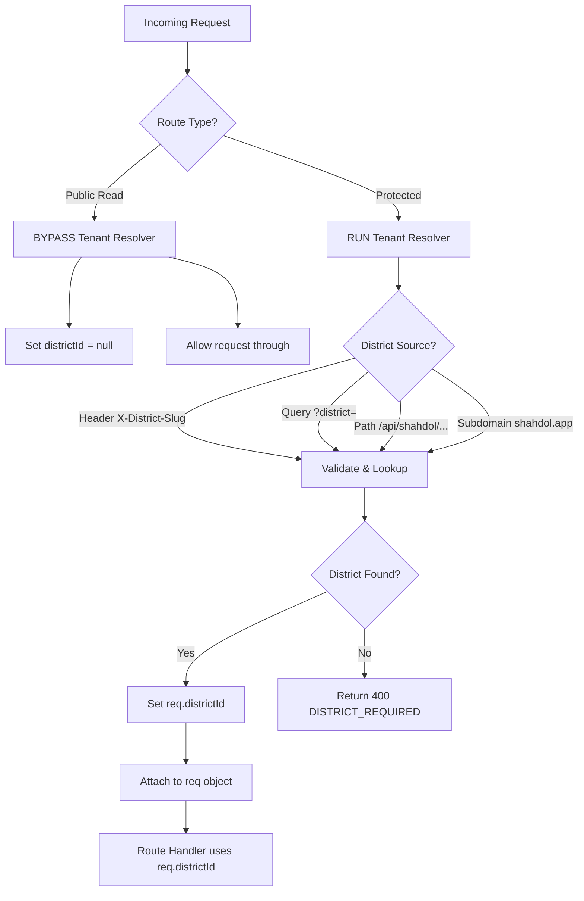
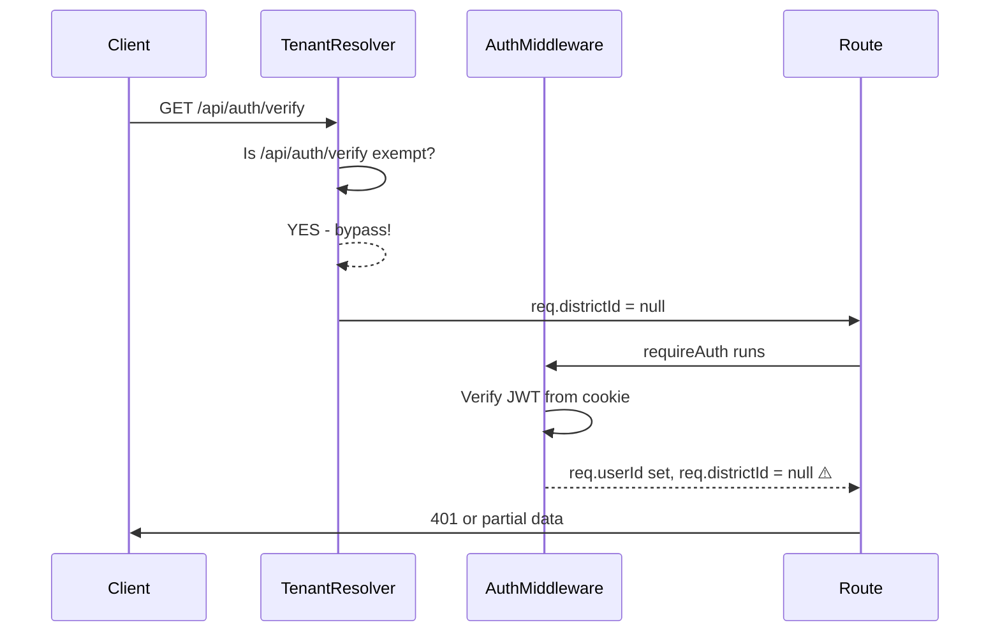
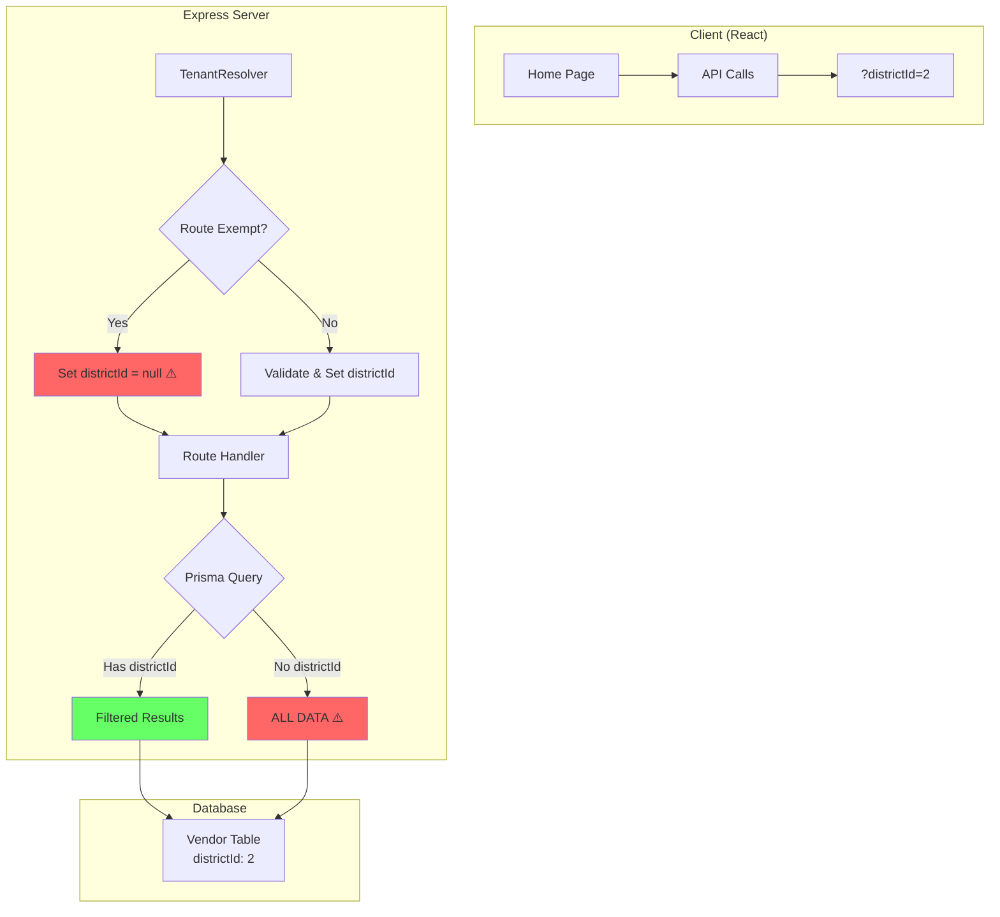

# SOVEREIGN ARCHITECTURE MAP - Shahdol Bazaar 2.0

## Executive Summary

This document provides a comprehensive System Audit and Logic Review of the Shahdol Bazaar 2.0 application, focusing on the Multi-Tenancy (District Context) system and identifying the root causes of recurring 400/401 errors and Playwright test failures.

---

## 1. Core Philosophy & Design: District Context (Multi-Tenancy)

### How Multi-Tenancy Should Work



### Current Implementation in Schema

The `District` model (lines 68-106 in `prisma/schema.prisma`) supports:
- **Unique slug-based identification** - `slug` field (e.g., "shahdol", "jabalpur")
- **White-label branding** - `primaryColor`, `logoUrl`, etc.
- **isDefault flag** - For fallback when no district specified
- **Relations to**: Vendors, Inquiries, Analytics, Buses, Users, Admins

### Route Categories

| Category | Routes | Tenant Resolver Behavior |
|----------|--------|-------------------------|
| **Exempt (Public)** | `/api/health`, `/api/ui/context`, `/api/districts/*` | Bypassed - `districtId = null` |
| **Tenant-Aware (Public)** | `/api/marketplace/*`, `/api/shops/*` | Optional - reads from query/header |
| **Protected (Auth Required)** | `/api/admin/*`, `/api/merchant/*`, `/api/orders` | Required - throws 400 if missing |

---

## 2. Context Deadlock Analysis

### Where TenantResolver is Failing

#### Problem 1: Routes Bypassing WITHOUT Default District

In `server/middleware/tenantResolver.ts` (lines 56-69), these routes are EXEMPT from tenant validation:

```typescript
const TENANT_EXEMPT_PREFIXES = [
  '/api/auth/login',
  '/api/auth/register',
  '/api/auth/refresh',
  '/api/auth/logout',
  '/api/auth/verify',  // ⚠️ CRITICAL: Auth verify is exempt!
  '/api/marketplace',  // ⚠️ CRITICAL: Marketplace is exempt!
  // ...
];
```

When these routes are accessed:
1. The bypass logic sets `req.districtId = null` (line 198)
2. The route handler expects `districtId` to exist
3. **Result**: 400 error even when valid district is passed via query

#### Problem 2: Query Parameter Not Read by Routes

In `server/routes.ts` (line 306), the `/api/marketplace/stores` route ONLY reads from `req.districtId`:

```typescript
const districtId = req.districtId;  // ❌ Only reads from req object
if (!districtId) {
  return res.status(400).json({ code: 'DISTRICT_REQUIRED' });
}
```

**It ignores** `req.query.districtId` even when the frontend passes it!

#### Problem 3: Inconsistent Middleware Order

Looking at `server/index.ts` (lines 430-464), there's complex conditional logic:

```typescript
// Line 440-448: Public GET routes bypass entirely
const isPublicReadOnly = PUBLIC_READ_ONLY.some(route => ...);
if (req.method === 'GET' && isPublicReadOnly) {
  return next();  // ⚠️ Never sets districtId!
}

// Line 456-459: Marketplace routes call tenantResolver but can return null
if (pathToCheck.startsWith('/marketplace/')) {
  return tenantResolver(req, res, next);  // Can return null!
}
```

### Why 400 Errors Occur Despite districtId in Query

1. **Frontend sends**: `GET /api/marketplace/stores?districtId=2`
2. **TenantResolver bypasses**: Sets `req.districtId = null` for marketplace routes
3. **Route handler checks**: `req.districtId` - it's null!
4. **Returns 400**: "District context is required"

---

## 3. Authentication vs. Tenancy: The Deadlock

### Current Auth Flow



### The Problem

1. `/api/auth/verify` is in TENANT_EXEMPT_PREFIXES (line 62)
2. When called, `req.districtId` is set to `null`
3. The user IS authenticated (JWT verified), but **district context is lost**
4. Any subsequent call requiring district context fails

### JWT + httpOnly Cookie Flow

From `server/auth/middleware.ts`:
- **requireAuth**: Checks `Authorization: Bearer <token>` OR `req.cookies.accessToken`
- **Token contains**: `userId`, `role`, `districtId` (if user has one)
- **Issue**: The token's `districtId` is NOT being propagated back to `req.districtId`

---

## 4. Playwright Test Failure Post-Mortem

### Test Environment Issues

1. **No Default District**: Tests run against `localhost:5174` but:
   - No district is set in test requests
   - TenantResolver throws 400 errors
   - Tests can't proceed past initial page load

2. **Missing Auth Setup**: Tests like `e2e-sovereign-audit.spec.ts`:
   - Try to register/login users
   - But auth routes bypass tenant context
   - User is created but without proper district association

3. **Object-as-Child Errors**: The React components might be rendering objects instead of strings:
   - `{offer}` instead of `{offer.content}` in some edge cases
   - This causes React warnings and potential crashes

### Why Tests Are Failing

| Test | Failure Reason |
|------|----------------|
| Homepage loads | 400 error from marketplace API calls |
| Auth login | User created but district context lost |
| Admin redirect | 401 after login (district context missing) |
| Marketplace stores | 400 DISTRICT_REQUIRED despite query param |

---

## 5. Data Integrity: Routes Missing districtId Filter

### Critical: Routes Without District Isolation

| Route | File:Line | Issue |
|-------|-----------|-------|
| `/api/offers` | `routes.ts:1982` | No districtId filter - returns ALL offers |
| `/api/products` | `routes.ts:1351` | No districtId filter |
| `/api/shops` | `routes.ts:1429` | No districtId filter |
| `/api/vendors` | `routes.ts:2474` | No districtId filter |
| `/api/banners` | `routes.ts:1918` | No districtId filter |
| `/api/bus-timetable` | `routes.ts:354` | Has districtId (optional) |

### What SHOULD Happen

```typescript
// Current (BROKEN)
const offers = await prisma.offer.findMany();

// Should Be
const offers = await prisma.offer.findMany({
  where: {
    districtId: req.districtId  // Filter by current district!
  }
});
```

---

## TOP 5 STRUCTURAL FLAWS

### 🔴 FLAW #1: TenantResolver Bypass Loses District Context
**Severity**: CRITICAL  
**Impact**: 400 errors on ALL marketplace and auth routes

**Root Cause**: Lines 56-69 in `tenantResolver.ts` exempt `/api/marketplace` and `/api/auth/verify` from validation BUT don't set a default districtId.

**Fix Required**:
```typescript
// For exempted routes, set default districtId = 2 (Shahdol)
if (shouldBypassTenantValidation(req)) {
  if (!req.districtId) {
    req.districtId = 2; // Default to Shahdol
  }
  return next();
}
```

---

### 🔴 FLAW #2: Routes Ignore Query Parameter districtId
**Severity**: CRITICAL  
**Impact**: Frontend can't pass districtId via URL

**Root Cause**: Routes only read from `req.districtId` (set by middleware), ignoring `req.query.districtId`

**Fix Required**:
```typescript
// In each route that needs districtId
let districtId = req.districtId;
if (!districtId && req.query.districtId) {
  districtId = parseInt(req.query.districtId as string, 10);
}
```

---

### 🔴 FLAW #3: No DistrictId Filter on Prisma Queries
**Severity**: HIGH  
**Impact**: Data leakage across districts

**Root Cause**: Multiple routes return data WITHOUT filtering by `req.districtId`

**Fix Required**: Add districtId to all where clauses:
```typescript
where: {
  districtId: req.districtId,  // MUST be present!
  // ... other filters
}
```

---

### 🔴 FLAW #4: Auth Verify Route Loses District Context
**Severity**: HIGH  
**Impact**: 401 errors after successful login

**Root Cause**: `/api/auth/verify` is in exempt list, so `req.districtId` is null after authentication

**Fix Required**:
1. Remove `/api/auth/verify` from exempt list OR
2. Extract districtId from JWT and set on req

---

### 🟡 FLAW #5: Test Environment Missing Default District
**Severity**: MEDIUM  
**Impact**: Playwright tests fail consistently

**Root Cause**: Tests don't set `?district=shahdol` on requests

**Fix Required**:
1. Add `?district=shahdol` to all test API calls
2. OR modify TenantResolver to default to Shahdol in test environment

---

## RECOMMENDED SURGICAL FIXES

### Priority 1: Fix TenantResolver Bypass (Immediate)
- [ ] Update `server/middleware/tenantResolver.ts` to set default districtId = 2 for exempted routes
- [ ] This fixes the 400 errors immediately

### Priority 2: Fix Route districtId Reading (Immediate)
- [ ] Update `server/routes.ts` to read from `req.query.districtId`
- [ ] This allows frontend to pass district via URL

### Priority 3: Add districtId to All Prisma Queries (High Priority)
- [ ] Audit all routes in `server/routes.ts`
- [ ] Add `districtId: req.districtId` to every Prisma query

### Priority 4: Fix Auth District Propagation (High Priority)
- [ ] Update JWT payload to include districtId
- [ ] Extract districtId from JWT in requireAuth middleware

### Priority 5: Update Playwright Tests (Medium Priority)
- [ ] Add `?district=shahdol` to all API calls in tests
- [ ] Add auth setup with district context

---

## Architecture Diagram



---

*Document Version: 1.0*  
*Created: 2026-03-15*  
*Purpose: System Audit for Shahdol Bazaar 2.0*
